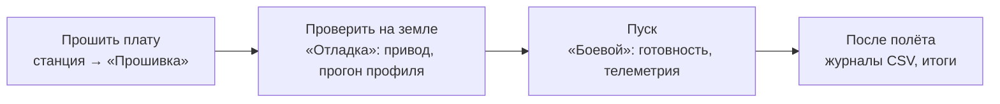

# ВРО-1 / RocketBoard — бортовое ПО учебной водяной ракеты

Проект «Технологии космоса / Реактивное движение». Плата авионики на
ATmega32U4: датчики, автомат полёта, парашют, телеметрия по радио и на карту.
Плюс программа для земли (Windows): приём, отладка, прошивка, журналы CSV.



## Быстрый старт (Windows)

1. **Code → Download ZIP**, распаковать («Извлечь все…»).
2. Запустить **`СТАНЦИЯ И ОТЛАДКА.bat`** (нужен Python 3). Режим «Прошивка»:
   выбрать прошивку, порт платы, «Прошить плату». Интернет не нужен.
   Без Python: **`ПРОШИТЬ ПЛАТУ.bat`** (мастер) или [собрать `.exe`](ground/README.md#сборка-exe).
3. Перед пуском: [docs/OPERATOR.md](docs/OPERATOR.md).

## Документы

| Файл | О чём |
|---|---|
| [docs/OPERATOR.md](docs/OPERATOR.md) | **оператору**: чек-лист перед пуском, прогон, если автоматика зависла |
| [ground/README.md](ground/README.md) | станция: режимы, кнопки, журналы, сборка `.exe` |
| [docs/PROTOCOL.md](docs/PROTOCOL.md) | формат радиопакета, команды, что борт когда принимает, USB-строка |
| [docs/RADIO.md](docs/RADIO.md) | HC-12: схема, настройка, проверка канала |
| [docs/HANDOFF.md](docs/HANDOFF.md) | **разработчику**: где мы, уроки, что дальше |
| [docs/TESTING.md](docs/TESTING.md) | результаты испытаний и найденные дефекты |
| [docs/HARDWARE.md](docs/HARDWARE.md), [BOARD_GUIDE.md](docs/BOARD_GUIDE.md) | что на плате, распиновка, датчики |
| [docs/MEMORY.md](docs/MEMORY.md), [TOOLCHAIN.md](docs/TOOLCHAIN.md) | флеш и ОЗУ; сборка из исходников |
| [release/FLASHING.md](release/FLASHING.md) | прошивка для школьников и студентов |
| [docs/JOURNAL.md](docs/JOURNAL.md) | хроника работ и решений |
| [ТЗ v0.2](TZ_bortovoe_PO_vodyanaya_raketa_v0.2.md) | техническое задание |

## Состояние на 29.09.2026

Прошивка работает на железе (наборы A и C), радио проверено в обе стороны с
антеннами (P8). В воздух ракета **ещё не летала**: пороги предварительные, **углы привода
(20°/120°) произвольные**, механики спасения нет. Не проверено на железе: MicroSD
(наборы B, D), станция и `.exe` на Windows, открытие парашюта по радио в полёте.
Подробно: [docs/HANDOFF.md](docs/HANDOFF.md).

<details><summary>Установлено достоверно</summary>

- Контроллер ATmega32U4 (Arduino Leonardo, `2341:8036`), IMU **ICM-20948** (`0x68`, не
  MPU9250), барометр **BMP280** (`0x77`), серва SG90 на D6, **HC-12 v2.6** (9600, канал 001, FU3).
- Батарея «Крона», делитель за диодом SS14: плата видит на ~0,45 В меньше, чем на клеммах.
- Распиновка сверена со схемой `DevBoard_Std_A3.pdf` (пп. 47.2, 47.5 закрыты).

</details>

## Наборы железа

Состав платы выбирается **при компиляции** (одна прошивка на все конфигурации не
помещается), полётный код общий для всех.

| Набор | Состав | Флеш | ОЗУ | Радиокоманды |
|---|---|---|---|---|
| `a_basic` | датчики + серва | 22 630 (79 %) | 794 (31 %) | нет |
| `c_radio` | + HC-12 | 26 650 (93 %) | 1 166 (46 %) | **да** |
| `b_sd` | + MicroSD | 26 170 (91 %) | 1 532 (60 %) | нет |
| `d_full` | полный (карта + радио) | 28 588 (**99,7 %**) | 1 860 (73 %) | нет, нет места |

## Сборка (разработчикам)

```sh
cd firmware
./build.sh all                  # все наборы с расходом памяти
./build.sh c_radio upload       # собрать и залить
./build.sh release              # обновить release/bin (обязательно перед коммитом прошивки)
python3 -m unittest discover ../ground      # проверки станции
```

Нужен `arduino-cli`, библиотеки лежат в проекте: [docs/TOOLCHAIN.md](docs/TOOLCHAIN.md).

<details><summary>Структура проекта</summary>

```
СТАНЦИЯ И ОТЛАДКА.bat   станция (Windows)        ПРОШИТЬ ПЛАТУ.bat   мастер прошивки
release/    bin/ (готовые .hex)  avrdude/ (Windows)  windows/ (мастер, драйверы)  FLASHING.md
docs/       OPERATOR PROTOCOL RADIO HANDOFF TESTING HARDWARE BOARD_GUIDE MEMORY TOOLCHAIN JOURNAL
ground/     станция: vro_*.py, telemetry.py, тесты, vendor/ (pyserial)
tools/      hc12_setup, radio_test.py, servo_radio_stress, hw_probe, imu_*, pack_station_zip.py
firmware/   firmware.ino (главный цикл)  build.sh  libraries/ (Servo, SdFat)  test/ (проверки на компьютере)
  src/      hw/ (наборы)  config.h  pins.h  drivers/  flight_state  recovery  sensors  telemetry
            radio  cmdframe.h  timing.h  power  service  sim  sd_logger  diagnostics  strbuf  dbg.h
```

</details>

## Лицензия

MIT, см. [LICENSE](LICENSE).
