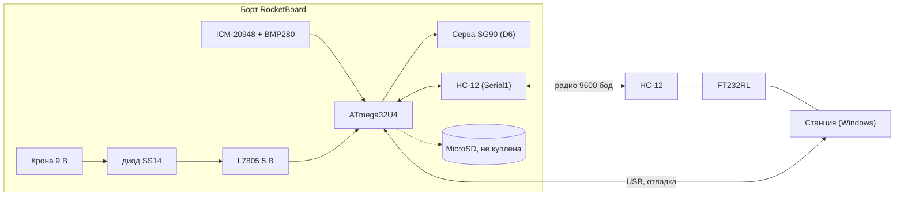

# Как продолжить работу

Для того, кто продолжит проект. Нужно только прошить плату? `ПРОШИТЬ ПЛАТУ.bat`
или режим «Прошивка» в станции, этот документ не нужен ([release/FLASHING.md](../release/FLASHING.md)).
Оператору перед пуском: [OPERATOR.md](OPERATOR.md).

Состояние на **29 сентября 2026 г.**

## Где мы

Прошивка работает на железе (наборы **A** и **C**), автомат полёта отработан на
имитации. Радио проверено в обе стороны с антеннами на P8. Есть станция
для Windows (приём, отладка по проводу и радио, прошивка, журналы CSV).
Батарея, готовность к пуску, итоги полёта, открытие парашюта командой с земли:
готово. В воздух ракета **ещё не летала**, поэтому все пороги предварительные.



| Сделано и проверено на железе | Написано, не проверено на железе |
|---|---|
| датчики, автомат полёта (старт, апогей, раскрытие, резерв, посадка), сервис привода, прогон профиля | наборы **B** и **D** (нет модуля MicroSD, журнал на карте) |
| радиотелеметрия, CRC, повтор событий, батарея, ноль высоты | станция и `.exe` на **Windows** (проверялось на Linux и по данным пользователя) |
| радиокоманды: привод, ноль, возврат в READY, приём на плате (`rx=`) | «Открыть парашют» **в полёте** по радио (команда проверена в READY и логикой) |
| станция: 4 режима, прошивка, журналы, тема, снимок экрана | мастер прошивки `ПРОШИТЬ ПЛАТУ.bat` на Windows |

**Не сделано:** механика спасения и **углы привода** (20°/120° произвольные), watchdog
(п. 32), натурный полёт, ориентация осей IMU (п. 47.4, автомату не мешает),
запас флеша в `d_full` всего 84 байта.

## Рабочий цикл

```sh
cd firmware
./build.sh all                    # все наборы и расход памяти
./build.sh c_radio upload         # собрать и залить (PORT=/dev/ttyACM1 для другого порта)
./build.sh release                # пересобрать release/bin (обязательно перед коммитом прошивки)
cd test && g++ -std=c++11 -Wall -Wextra -I../src test_cmdframe.cpp -o /tmp/t && /tmp/t   # и test_timing.cpp
python3 -m unittest discover ground     # проверки станции, железо не нужно
python3 tools/pack_station_zip.py       # архив для сборки .exe на Windows
```

**Правило:** менялась прошивка, значит пересобрать `release/bin` (`./build.sh release`)
и закоммитить вместе с правкой, иначе мастер и станция раздают старое. Подробности
сборки: [TOOLCHAIN.md](TOOLCHAIN.md).

## Главные уроки последних дней

1. **Событие не доказывает, что привод двинулся.** `RECOVERY_DEPLOY` уходит и при
   неподвижной серве. Смотреть `sv=` в отладочной строке (после раскрытия 120 около
   1,2 с). Так нашли ошибку: `Recovery::update` сравнивал `now` цикла с `millis()` из
   `deploy()` беззнаково и отпускал привод в тот же проход. Правило: разность времени
   знаковая (`firmware/src/timing.h`), проверено на компьютере. См. [TESTING.md](TESTING.md).
2. **Раскрытие выдаётся один раз (п. 13).** Уже раскрытое спасение не раскроется в прогоне:
   `r` теперь отказывает, `R` возвращает.
3. **Борт сам в READY не возвращается** и не должен: только команда оператора или питание.
   Любое автовосстановление автомата не добавлять.
4. **Каждый байт в эфире считать.** Буфер `Serial1` 64 байта; пакет и длинное событие не
   влезают вместе. Полётный `d_full` 28 588 из 28 672: новое поле в пакете едва не выкинуло
   его из флеша, помог целочисленный расчёт напряжения.
5. **Данные идут, а станция пишет «нет данных»:** в радиорежиме выбран порт платы по USB,
   а не приёмник FT232 (после прошивки список портов сбрасывается на первый).

<details><summary>Грабли по железу и инструментам (читать перед правками)</summary>

**Железо.** Серву подключать **до** подачи питания (бросок тока вешает плату, шина +5 В
общая). Стоит **ICM-20948**, не MPU9250 (другая карта регистров). Имена цепей на схеме не
равны именам выводов Arduino (цепь «A2» на J8 это A1). Делитель батареи стоит **за диодом
SS14**: плата видит на ~0,45 В меньше, чем мультиметр на клеммах.

**Библиотеки.** `Wire.setWireTimeout(3000, true)` обязательна (иначе шина вешает программу, а
в полёте это невышедший парашют). Штатная `SD` не влезает, используется урезанная `SdFat`,
её настройки только флагами сборки. `printf` не используем (полтора килобайта), строки
собирает `strbuf.h`; `float` и деление 32-битных на AVR дороги.

**USB ATmega32U4.** Не печатать в `setup()`. Не `while (!Serial)`. Конечная точка отдаёт 64
байта. Не «защищать» вывод проверкой `availableForWrite` (взаимная блокировка). После заливки
порт меняет имя, ждать ~6 с. Открывая порт своей программой, включайте DTR. Перемежающийся
отказ не бисектировать одним прогоном на вариант.

**Инструменты.** `arduino-cli` 1.5.1 игнорирует `build_properties` профиля: флаги только
через `--build-property` (признак беды: все наборы одного размера). Параметры в `config.h`
обёрнуты в `#ifndef`, иначе `-D` не переопределит. `wizard.ps1` только UTF-8 с BOM и CRLF.

**Старт и ноль.** Не требовать два признака старта в один миг (нужно окно
`LAUNCH_BARO_WINDOW_MS`). Неподвижность по осям, не по модулю. Ноль высоты не ждать в INIT.

**Радио.** Полётная прошивка вывод `SET` не трогает. Мощность хранит модуль. Потери на земле
бывают двух видов: `rdrop=0` эфир, `rdrop>0` борт сам выбросил. Привод при движении портит
передачу (вероятно, питание).

</details>

<details><summary>Принятые решения (не переигрывать без причины)</summary>

Набор железа выбирается **при компиляции**, полётный код общий для всех наборов (копии
разойдутся, и в одной не выйдет парашют). Драйверы датчиков свои, без библиотек. Гироскоп
читается, но в решениях автомата не участвует; апогей по барометру. Радио передаёт вслепую
(п. 23). Библиотеки, avrdude, pyserial лежат в проекте (сборка не зависит от чужого компьютера).
Прошивают через мастер или станцию, а не через Arduino IDE. Возврат в READY и раскрытие
парашюта только по явной команде оператора.

</details>

## Что делать дальше

1. **Подобрать углы привода** на настоящей механике (п. 47.8): найти кнопками углов положения
   «замок закрыт» и «замок открыт», поменять `RECOVERY_SERVO_*_ANGLE` в `config.h`.
2. **Питание привода:** свежая Крона, померить просадку шины при движении; при необходимости
   конденсатор 470–1000 мкФ или отдельное питание привода.
3. **Проверить на Windows** станцию (`.exe`), мастер прошивки и снимок экрана.
4. Купить **MicroSD**, проверить наборы B и D (карта FAT32, `CS` на D4, согласование уровней, п. 47.10).
5. Решить, на какой прошивке лететь: `c_radio` (радиокоманды, без журнала) или `d_full`
   (журнал, но без «Открыть парашют»).
6. Первый натурный полёт, затем уточнить пороги в `config.h`: `LAUNCH_ACCEL_THRESHOLD_G`,
   `APOGEE_DROP_THRESHOLD_M`, `BACKUP_DEPLOY_TIME_MS` (**зазор до основного срабатывания 520 мс**),
   `LANDING_*`, `LAUNCH_BARO_WINDOW_MS`, `GROUND_STILL_*`.

## Где что лежит

```
ПРОШИТЬ ПЛАТУ.bat   мастер прошивки (Windows)      СТАНЦИЯ И ОТЛАДКА.bat   станция
TZ_..._v0.2.md      ТЗ                            DevBoard_Std_A3.pdf     схема платы
docs/       OPERATOR (оператору)  PROTOCOL (радио и команды)  RADIO  HARDWARE  BOARD_GUIDE
            TESTING (результаты)  MEMORY (флеш, ОЗУ)  TOOLCHAIN (сборка)  JOURNAL (хроника)
firmware/   src/ (прошивка)  test/ (проверки на компьютере)  libraries/ (Servo, SdFat)
ground/     станция и проверки (vro_*.py, telemetry.py)   vendor/ (pyserial)
tools/      hc12_setup  radio_test.py  servo_radio_stress  hw_probe  imu_*  pack_station_zip.py
release/    bin/ (готовые .hex)  avrdude/ (Windows)  windows/ (мастер, драйверы)  FLASHING.md
```
