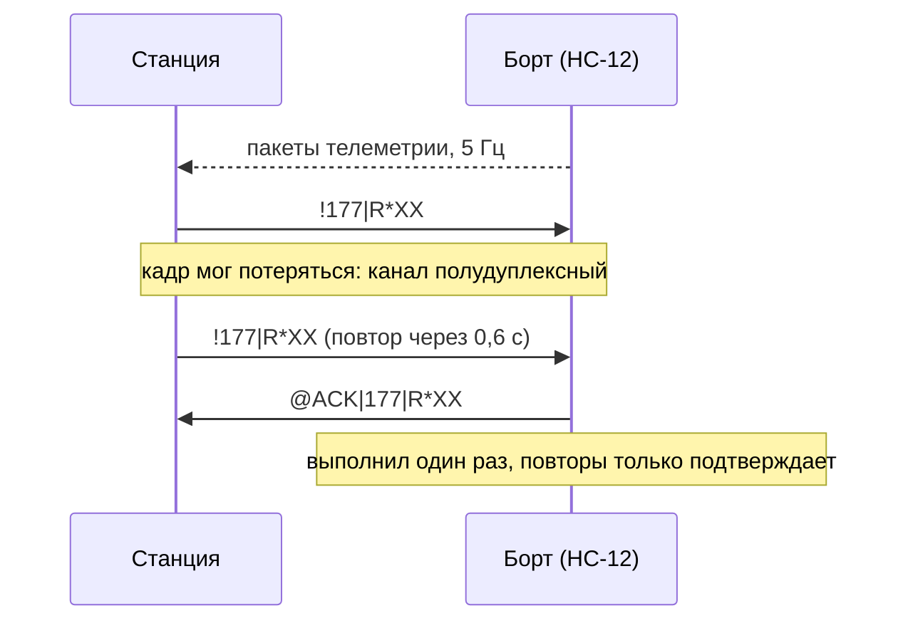
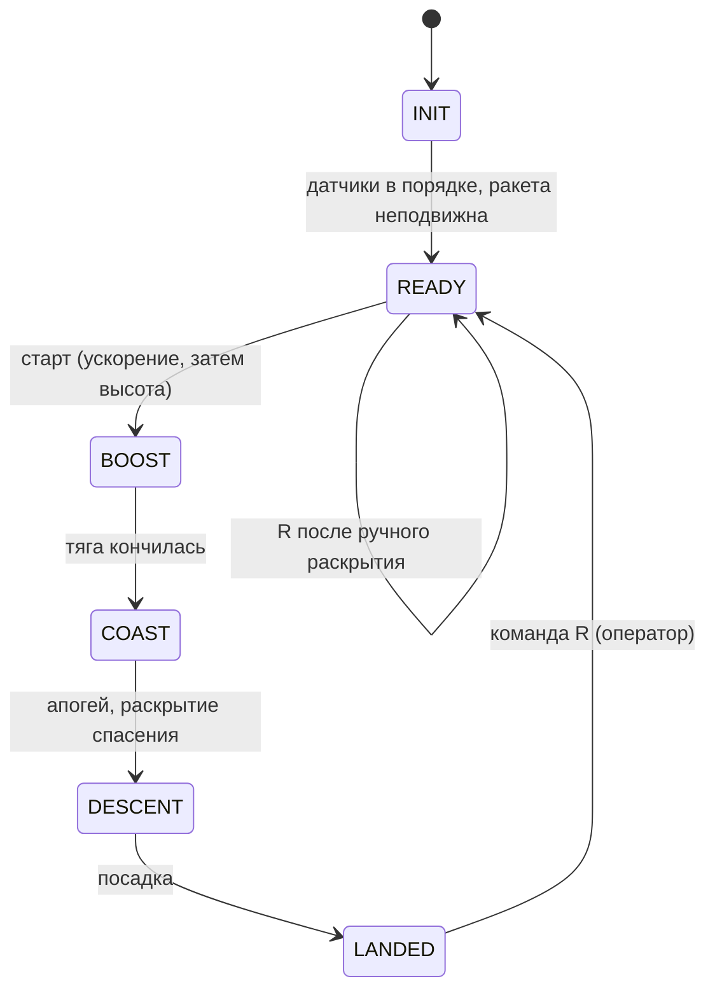

# Протокол: радио и USB

Что борт говорит на землю, что земля может сказать борту, и какие
команды когда принимаются. Реализация: `firmware/src/radio.cpp`,
`cmdframe.h`, `ground/telemetry.py`, `ground/vro_link.py`.

## Борт → земля (9600 бод, HC-12)

Одна строка на пакет, 5 раз в секунду:

```
642|12840|COAST|87.42|99584|ARMED|0|911*3F
```

| Поле | Что |
|---|---|
| 642 | номер пакета, +1 на каждый ушедший пакет (по разрывам считаются потери) |
| 12840 | время борта, мс |
| COAST | состояние: `INIT READY BOOST COAST APOGEE DESCENT RECOVERY LANDED ERROR` |
| 87.42 | высота, м |
| 99584 | давление, Па |
| ARMED | спасение: `SAFE ARMED DEPLOYED ERROR` |
| 0 | флаги ошибок (таблица ниже) |
| 911 | напряжение батареи за диодом, сотые доли В (9,11 В); 0 = не измерено |
| `*3F` | CRC-8 всего, что до `*` |

Поле напряжения необязательное: строки из 7 полей и без CRC станция тоже
принимает (старые прошивки, журнал с карты). Строка с неверной CRC
отбрасывается и считается испорченной.

**События** идут отдельными строками: `#12840|APOGEE_CONFIRMED*9F`. Каждое
уходит сразу и ещё 3 раза с интервалом не меньше 0,7 с (одноразовая
строка при порче пропала бы насовсем). Станция отбрасывает дубли по
паре «время, имя».

<details><summary>Имена событий и флаги ошибок</summary>

События: `POWER_ON SENSORS_OK SD_OK SD_FAIL RADIO_OK RADIO_FAIL READY
LAUNCH_DETECTED BOOST_END APOGEE_CONFIRMED RECOVERY_DEPLOY DESCENT LANDED
CRITICAL_ERROR BACKUP_DEPLOY GROUND_ZERO`.

Флаги: `0x0001` датчики, `0x0002` барометр, `0x0004` IMU (эти три
критические), `0x0008` карта не поднялась, `0x0010` ошибка записи,
`0x0020` радио, `0x0040` привод, `0x0080` тайминги, `0x0100` нет нуля
высоты, `0x0200` низкое напряжение батареи (< 6,7 В, около 20 % по кривой разряда).

</details>

<details><summary>CRC и почему не иначе</summary>

CRC-8, полином 0x07, начальное значение 0, без отражения; проверочный
вектор: `"123456789"` даёт `0xF4`. Одинаково в `cmdframe.h`,
`telemetry.py`, тестах. Нужна потому, что порча в эфире иначе неотличима
от данных: 29.09.2026 порченый номер пакета прошёл как настоящий.

Буфер `Serial1` 64 байта, на 9600 бод он пустеет ~1 байт/мс. Пакет
(~50 байт) и длинное событие вместе не влезают, поэтому повторы событий
уходят через 60 мс после пакета из `Radio::update()`.

</details>

## Земля → борт (кадр команды)

```
!177|Z*XX\n        ! номер | команда * CRC
```

Ответ борта: `@ACK|177|Z*XX`. Станция повторяет кадр, пока ответа нет
(HC-12 полудуплексный, кадр может потеряться при столкновении с
телеметрией). Тот же номер в течение 4 с борт второй раз не выполняет,
только подтверждает. Команда старше 2 с не исполняется.



| Команда | Что делает |
|---|---|
| `s` / `d` | привод в SAFE / DEPLOYED (проверка) |
| `0`…`9` | угол привода 0…180 с шагом 20° |
| `t` | цикл открыть → закрыть |
| `r` | прогон тестового профиля (отказ, если спасение уже раскрыто) |
| `z` | заново поставить ноль высоты (ракета неподвижна ~8 с) |
| `R` | вернуть в READY: после посадки или после ручного раскрытия |
| `D` | **открыть парашют** (раскрытие один раз, как резервное) |

**Что когда принимается:**

| Состояние борта | По радио | По USB |
|---|---|---|
| `READY` | все, кроме условий `r`/`R` выше | все + `i` `?` |
| `LANDED` | только `R` | только `R` |
| в полёте (`BOOST`…`RECOVERY`, `INIT`) | **только `D`** | ничего |



Борт сам из посадки в READY не возвращается: только команда `R` или
питание. Радиокоманды есть **только в наборе `c_radio`** (в `d_full` нет
места во флеше).

Повторы станции: обычная команда 6 раз через 0,6 с, `D` до 30 раз через
0,4 с.

## USB (115200)

Отладочная строка 5 раз в секунду:

```
15635 READY h=-0.06 max=0.00 |a|=1.01 p=99311 rec=ARMED z=1 vb=8.08 err=0x200 rdrop=0 sv=-1 rx=34/3/0
```

| Поле | Что |
|---|---|
| `z` | ноль высоты поставлен (1) |
| `vb` | батарея за диодом, В |
| `rdrop` | сколько пакетов и событий борт сам выбросил (не хватило буфера) |
| `sv` | угол, выданный приводу; `-1` привод отпущен. **После раскрытия ~1,2 с должно быть 120** |
| `rx` | приём радиокоманд: байт / верных кадров / отвергнутых |

События печатаются строками `[EV 12840] APOGEE_CONFIRMED`.
Соотношение `rx`: байты растут, кадров 0, значит приходит мусор (скорость,
канал); байтов нет вообще, значит не доходит провод HC-12 → D0.

<details><summary>Сервисные клавиши USB</summary>

`?` справка, `i` сведения (железо, давление площадки, батарея, флаги, пропуски
радио), `s d t 0..9 r z R` как в таблице, `D` открыть парашют (только в
READY по USB).

</details>
